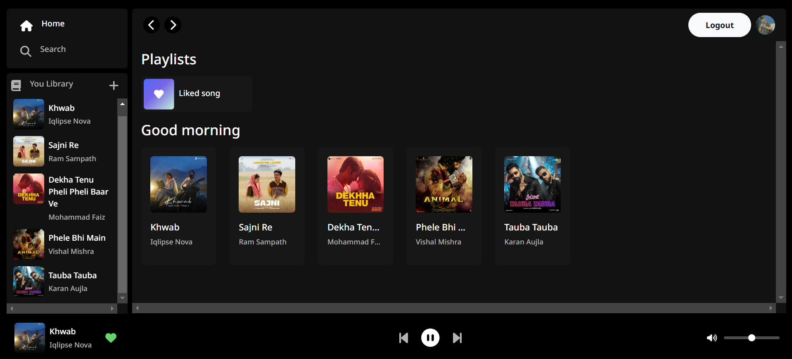
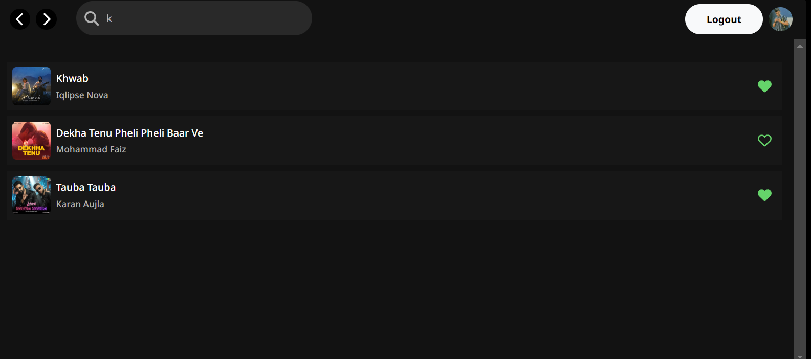

# SpotifyClone

SpotifyClone is a web application created using Spring Boot, Bootstrap, Angular, and PostgreSQL. This application allows users to:

- Sign in using OAuth2.
- Listen to songs.
- Search for songs.
- Add songs.
- Mark or remove songs as favorites.

### Features

- **OAuth2 Authentication**: Secure login using OAuth2.
- **Music Library**: Browse and search a vast collection of songs.
- **Favorites**: Mark songs as favorites for quick access.
- **Responsive Design**: Beautifully designed UI with Bootstrap, ensuring compatibility across devices.

### Screenshots

